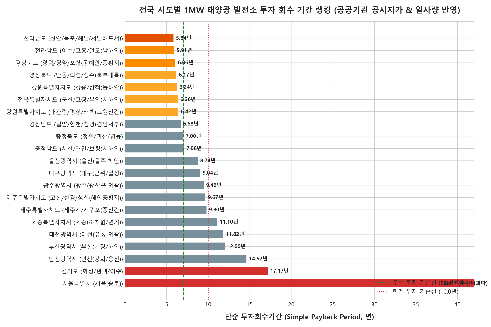
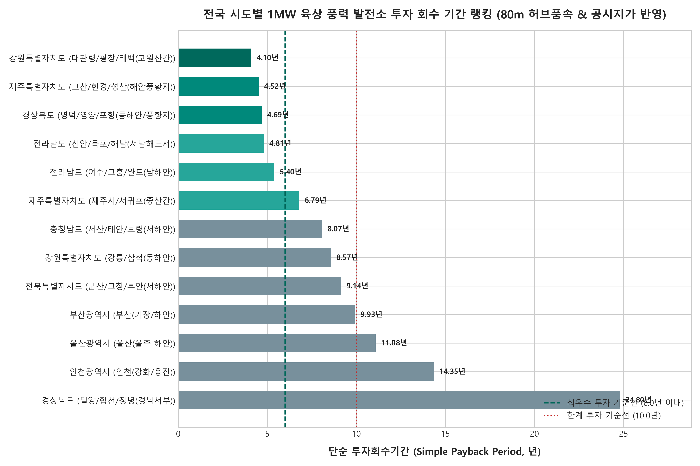
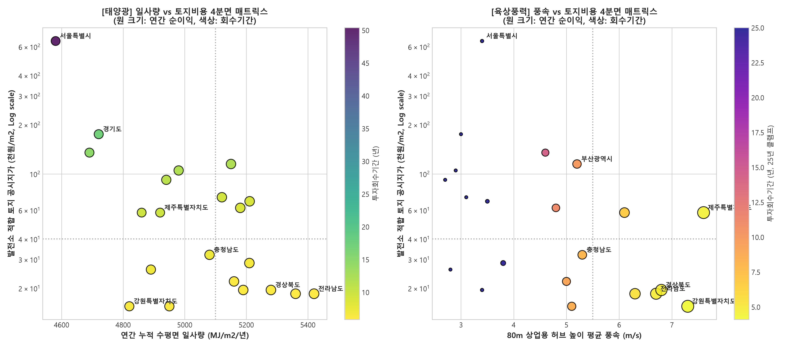
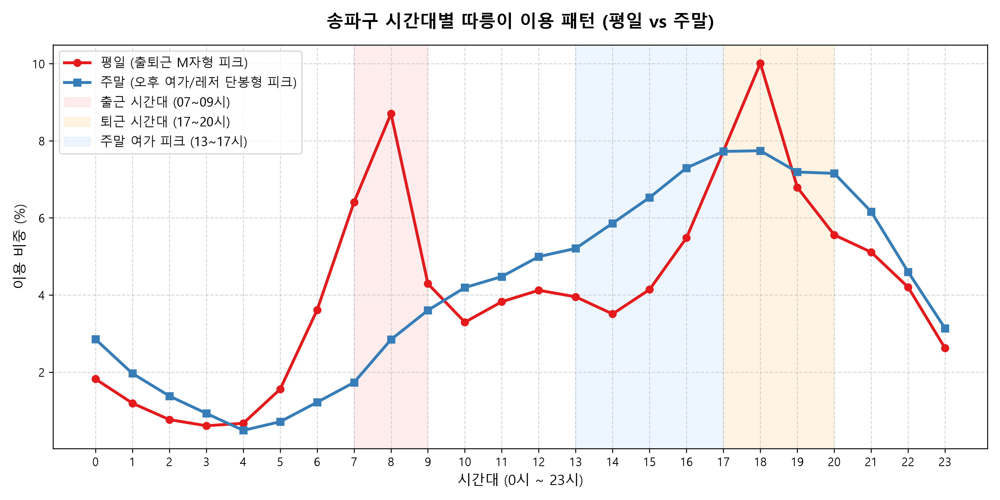

# 📊 Data_Analysis: 공공데이터 기반 실전 데이터 사이언스 & 머신러닝 포트폴리오

> **공공데이터(기상청 · 국토교통부 · 전력거래소 · 서울시) 및 오픈 데이터셋 기반의 정밀 탐색적 데이터 분석(EDA), 통계적 수리 모델링, 인터랙티브 GIS 시각화, 머신러닝 파이프라인 및 웹 애플리케이션 통합 저장소**

---

## 🌟 프로젝트 개요 (Overview)

본 저장소는 실생활과 산업계의 현실적인 문제들을 데이터 사이언스 방법론으로 해결한 다양한 도메인의 데이터 분석 프로젝트들을 집약한 통합 포트폴리오입니다.
기상 기후 평년값, 부동산 공시지가, 교통량, 전력망 수급 실적, 범죄 통계 등 **공인된 대규모 공공데이터**를 기반으로 수집·정제부터 공학적 수리 계산, 머신러닝 예측 모델링, 인터랙티브 대시보드 및 웹 서비스 배포까지의 풀스택 데이터 파이프라인을 다룹니다.

---

## 📁 프로젝트 구조 (Repository Architecture)

```
Data_Analysis/
├── 🚲 Bike_Sharing/              # 서울시 송파구 공공자전거(따릉이) OD 이동량 및 수요 패턴 분석
│   ├── seoul_bike_songpa_analysis.ipynb   # 5개년 시계열 및 통행 흐름 분석 풀스택 노트북
│   ├── data/                              # 대여소 위치, 월별 승하차, OD 통행 원천/정제 데이터
│   ├── charts/                            # 시간대별 이용패턴, 히트맵, 24시간 타임랩스 GIF
│   ├── maps/                              # Folium AntPath 동적 이동 흐름 인터랙티브 지도
│   └── scripts/                           # 데이터 수집, 정제, 통행 분석 및 지도 생성 모듈
│
├── 🌞💨 Power_Station/           # 대한민국 최적 태양광·풍력 발전소 입지 및 투자비용 최단 회수 분석
│   ├── optimal_renewable_power_plant_analysis.ipynb # 1MW 기준 정밀 재무 경제성 평가 노트북
│   ├── data/                              # 기상청 ASOS, KIER 풍황, 국토부 공시지가, KPX/KEA 단가
│   ├── charts/                            # 회수기간 랭킹 차트, 기상-지가 4분면 타당성 매트릭스
│   ├── maps/                              # Folium 동심원(Concentric Halo) 인터랙티브 GIS 지도
│   └── scripts/                           # 공공데이터 전처리, 경제성 산정, 시각화 자동화 스크립트
│
├── 📹 CCTV/                      # 서울시 자치구별 CCTV 설치 현황 및 5대 범죄 상관관계 분석
│   ├── 01. CCTV_analysis.ipynb            # 인구수(고령자/외국인) 대비 자치구별 CCTV 배치 분석
│   ├── 02. Crime_analysis.ipynb           # 경찰서별 5대 범죄 발생 및 검거율 분석 (Choropleth 지도)
│   └── data/                              # 서울시 CCTV, 인구 통계, 범죄 통계, GeoJSON 지도 데이터
│
├── 🚢 Titanic/                   # 타이타닉 승선객 생존 예측 및 머신러닝 의사결정나무 모델링
│   ├── 7. Titanic.ipynb                   # 승객 특성별 EDA 및 DecisionTreeClassifier 생존율 예측
│   ├── titanic_column_description.ipynb   # 12개 승객 피처 종합 명세서 및 머신러닝 인사이트
│   └── data/                              # 승객 원천 데이터셋 (train.csv, titanic.xls)
│
├── ⚡ jeju/                      # 제주도 시간별 전력수급 및 HVDC 연계선 융통 전력 분석
│   ├── 제주_시간별_전력수급_통합_만들기.ipynb # 10개년(2016~2025) 시간별 전력수급 시계열 통합
│   ├── 제주_시간별_전력수급_통합_2016-2025.xlsx # 기저발전, 신재생, HVDC 연계선 통합 데이터
│   └── 제주전력망_데이터북.html           # 제주 계통 전력 통계 데이터북 리포트
│
├── 🌸 model/                     # Scikit-learn 붓꽃(Iris) 품종 분류 머신러닝 파이프라인
│   ├── load_iris_guide.ipynb              # Scikit-learn 공식 문서 스타일의 데이터셋 분석 가이드
│   ├── iris_classifier.py                 # K-Fold CV, 결정경계 및 혼동행렬 시각화 파이프라인
│   └── iris_decision_tree.joblib          # 학습 완료된 DecisionTree 모델 직렬화 파일
│
├── 📸 photo_map/                 # 사진 EXIF 메타데이터 기반 Google 지도 시각화 웹앱
│   ├── app.py                             # Flask 백엔드 (EXIF GPS/방향/고도 자동 추출 엔진)
│   └── README.md                          # 사진 위치 기반 지도 웹 애플리케이션 가이드
│
├── requirements.txt              # 전체 프로젝트 통합 패키지 의존성 정의 파일
└── README.md                     # 저장소 종합 안내 문서 (본 문서)
```

---

## 🔬 주요 프로젝트 상세 소개 (Featured Projects)

### 1. 🚲 서울시 송파구 공공자전거(따릉이) OD 이동량 및 수요 패턴 분석 (`/Bike_Sharing`)
- **분석 목적**: 서울 열린데이터광장 공식 공공데이터를 기반으로 송파구 220개 대여소의 최근 5개년(2021~2026) 월별 수요 및 8만 건의 OD 대여이력을 분석하여 자전거 재배치 최적화 및 인프라 구축 방향성 제시.
- **주요 내용**:
  - **시계열 수요 추이**: 코로나 전후 연도별·계절별 월간 승차/하차 이용량 패턴 분석.
  - **이용 행태 모델링**: 요일별×시간대별 24×7 통행량 히트맵 및 통근형(M자형 곡선) vs 여가형(주말 단봉형) 대여소 군집 분류.
  - **GIS 동적 시각화**:
    - **AntPath 파티클 애니메이션**: 기종점(OD) 간 실시간 통행 방향과 이동량을 흐르는 점선으로 시각화.
    - **4대 시간대별 분리 레이어**: 출근시간(07~09시), 퇴근시간(17~19시), 주간레저(11~15시), 야간귀가(21~04시).
    - **24시간 타임랩스 GIF**: 시간대별 통행 흐름 변화를 연속 영상으로 제작.

### 2. 🌞💨 대한민국 최적 태양광·풍력 발전소 입지 및 투자비용 최단 회수 분석 (`/Power_Station`)
- **분석 목적**: 기상청 종관관측(ASOS) 30년 평년값과 국토교통부 표준지 공시지가, 전력거래소(KPX) SMP 및 한국에너지공단(KEA) REC 단가를 결합하여 1MW 상업용 발전소의 전국 17개 시도별 최단 투자회수기간과 최적 입지 도출.
- **주요 내용**:
  - **공학적 발전량 산정**: PV 경사면 성능비(PR 0.81) 모델 및 상업용 80m 허브 높이 풍속 기반 터빈 출력 곡선(Rayleigh 분포 및 설비이용률) 수립 (제주 출력제어율 반영).
  - **재무 경제성 모델링**: 토지 공시지가를 반영한 총투자비(CAPEX), 전력 판매 수입, 유지보수비(OPEX), 단순/할인 투자회수기간(DPB), LCOE, 20년 ROI 산출.
  - **핵심 분석 결과**:
    - ☀️ **태양광 최적지**: **전라남도 (신안·목포·해남)** $\rightarrow$ 1MW 총투자비 약 14.66억원, **단순회수 5.84년 (할인회수 6.92년, ROI 242.8%)**
    - 💨 **풍력 최적지**: **강원특별자치도 (대관령·평창·태백)** $\rightarrow$ 1MW 총투자비 약 24.84억원, **단순회수 4.10년 (할인회수 4.63년, ROI 388.3%)**
    - 🎯 **복합 우수 지역**: 전남, 경북(영덕/포항), 강원 산간 등 태양광·풍력 하이브리드 클러스터 도출.
  - **시각화**: 랭킹 차트, 기상-지가 4분면 매트릭스, **Folium 동심원(Concentric Halo) 인터랙티브 GIS 지도** (레이어 컨트롤러, 미니맵, 플로팅 범례 포함).

### 3. 📹 서울시 자치구별 CCTV 설치 현황 및 범죄 분석 (`/CCTV`)
- **분석 목적**: 서울시 자치구별 CCTV 보급 현황과 인구 통계(고령자, 외국인 비율), 5대 강력범죄(살인·강도·강간·절도·폭력) 발생 건수 및 검거율 간의 통계적 상관관계를 분석.
- **주요 내용**:
  - 자치구별 인구 대비 CCTV 보급 비율 산출 및 회귀선(Scipy/Numpy) 도출을 통한 초과/부족 자치구 식별.
  - 5대 범죄 발생 건수 표준화(MinMaxScaler) 및 검거율 지표 산출.
  - Folium과 서울시 행정구역 GeoJSON을 활용한 **Choropleth(단계구분도)** 시각화.

### 4. 🚢 타이타닉 승선객 생존 예측 머신러닝 (`/Titanic`)
- **분석 목적**: 타이타닉 승선객의 인구통계학적 속성과 객실 정보, 가족 관계를 탐색하고 머신러닝 분류 알고리즘을 적용하여 생존 여부(`Survived`) 예측.
- **주요 내용**:
  - 12개 컬럼에 대한 결측치 처리, 파생변수 생성(호칭 추출 `Title`, 가족 규모 `FamilySize`), 범주형 데이터 인코딩.
  - Scikit-learn `DecisionTreeClassifier` 모델 학습 및 과적합 방지를 위한 가지치기(Max Depth, Min Samples Split) 튜닝.
  - 의사결정나무 구조 Graphviz/DOT 시각화 및 피처 중요도(Feature Importance) 분석.

### 5. ⚡ 제주도 시간별 전력수급 및 HVDC 연계선 데이터 분석 (`/jeju`)
- **분석 목적**: 전력거래소(KPX) 공식 데이터를 바탕으로 2016년부터 2025년까지 제주 계통의 시간별 전력수급 구조와 육지-제주 간 초고압직류송전(HVDC) 연계선의 역할을 분석.
- **주요 내용**:
  - 화력, LNG, 태양광, 풍력 발전소의 발전 실적 시계열 통합 및 전력수급 통합표(Excel) 구축.
  - 신재생에너지 출력제어(Curtailment) 리스크 분석 및 HVDC 융통 전력 흐름 파악.
  - 계통 운영 현황을 직관적으로 검토할 수 있는 데이터북 리포트 제공.

### 6. 🌸 Iris 품종 분류 머신러닝 파이프라인 (`/model`)
- **분석 목적**: 머신러닝의 대표적인 붓꽃(Iris) 벤치마크 데이터를 활용하여 데이터 탐색부터 모델 학습, 교차 검증, 결정경계 시각화, 모델 영속화까지의 표준 파이프라인 구현.
- **주요 내용**:
  - 특성 간 상관관계 히트맵, 4개 특성별 품종 분포 박스플롯 시각화.
  - Stratified K-Fold 교차 검증 및 Confusion Matrix 평가.
  - 2차원 결정 경계(Decision Boundary) 시각화 및 Joblib을 활용한 모델 직렬화(`iris_decision_tree.joblib`).

### 7. 📸 사진 EXIF 메타데이터 기반 위치 지도 웹앱 (`/photo_map`)
- **분석 목적**: 사진 파일에 내장된 교환 이미지 파일 형식(EXIF) 메타데이터를 파싱하여 지도상에 촬영 위치와 궤적, 촬영 방향을 시각화하는 풀스택 웹 애플리케이션.
- **주요 기술**: Python, Flask, Pillow, ExifRead, Google Maps JavaScript API.
- **주요 기능**:
  - GPS 위도/경도, 촬영 일시, 촬영 방향(Heading), 고도, 기기 정보 자동 추출.
  - Google 지도 위 썸네일 마커 및 방향 화살표 렌더링, 사진 상세 정보 모달 제공.

---

## 🛠️ 기술 스택 (Tech Stack)

| 분류 | 기술 및 라이브러리 |
| :--- | :--- |
| **Language** | `Python 3.10+` |
| **Notebook** | `Jupyter Notebook`, `IPython` |
| **Data Processing** | `Pandas`, `NumPy`, `OpenPyXL`, `Xlrd` |
| **Machine Learning** | `Scikit-learn`, `SciPy`, `Joblib`, `XGBoost`, `LightGBM` |
| **Data Visualization** | `Matplotlib`, `Seaborn`, `Folium` (Leaflet.js GIS) |
| **Web & App** | `Flask`, `Pillow (PIL)`, `Google Maps API` |

---

## 🚀 빠른 시작 가이드 (Quick Start)

### 1. 저장소 클론 (Clone Repository)
```bash
git clone https://github.com/yungoonkim/Data_Analysis.git
cd Data_Analysis
```

### 2. 가상환경 생성 및 패키지 설치 (Environment Setup)
```bash
# 가상환경 생성 (venv 또는 conda)
python -m venv venv
source venv/bin/activate  # Windows: venv\Scripts\activate

# 의존성 패키지 일괄 설치
pip install -r requirements.txt
```

### 3. 주피터 노트북 실행 (Run Jupyter Notebook)
```bash
jupyter notebook
```
- 브라우저가 실행되면 원하는 프로젝트 폴더(예: `Power_Station/`, `Bike_Sharing/` 등)로 이동하여 `.ipynb` 노트북을 열고 셀을 순차적으로 실행할 수 있습니다.

---

## 📈 주요 시각화 산출물 미리보기 (Preview Highlights)

| [Power_Station] 태양광 회수기간 랭킹 | [Power_Station] 풍력 회수기간 랭킹 |
| :---: | :---: |
|  |  |

| [Power_Station] 자원 vs 지가 매트릭스 | [Bike_Sharing] 주간/주말 이용패턴 |
| :---: | :---: |
|  |  |

---

## 📜 라이선스 및 데이터 저작권 (License & Data Sources)

- **소스 코드**: 본 저장소의 모든 소스 코드는 [MIT License](LICENSE)를 따릅니다.
- **공공데이터 출처**:
  - 기상청 (KMA) 기후평년값 및 종관기상관측(ASOS)
  - 국토교통부 (MOLIT) / 한국부동산원 / KOSIS 표준지 공시지가
  - 전력거래소 (KPX) 전력통계정보시스템 (EPSIS) 계통한계가격(SMP)
  - 한국에너지공단 (KEA) 신재생에너지센터 REC 거래실적 및 표준설비비
  - 서울특별시 서울 열린데이터광장 (공공자전거 따릉이, CCTV, 인구 통계)
  - 경찰청 서울시 5대 범죄 발생 및 검거 통계
